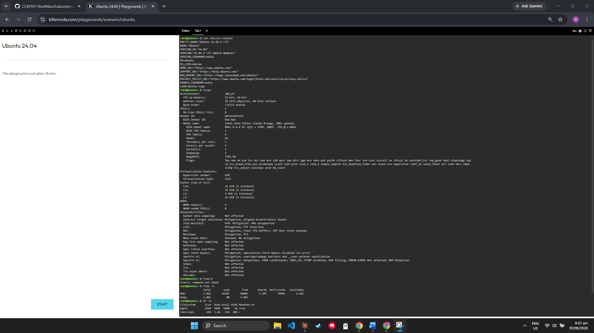

# Laboratory 03 - Multi-Cloud Explorer

## Linux Server Investigation (KillerCoda)

### Operating System
The server is running Ubuntu 24.04 LTS, a common version of Linux.

### CPU Information
The server has only 1 CPU core, running at 2.0GHz. It's a virtual machine (not a real physical computer), which we can tell because it uses KVM as the hypervisor.

### Memory
The server has about 2GB of RAM total, with roughly half of it free/unused at the time I checked.

### Disk Space
The server has 19GB of total storage, with about 13GB still available.

## Cloud Migration Question

**If this Linux server were migrated to the cloud, which AWS, Azure, and GCP services could host it?**

If this server were moved to the cloud, it's small enough to run on the basic virtual machine service from any provider:
- **AWS** – Amazon EC2
- **Azure** – Azure Virtual Machines
- **GCP** – Compute Engine

These services all let you create a small virtual server, similar in size to this one, running Ubuntu or another Linux distribution. Since this server only needs 1 CPU core and about 2GB of RAM, it would fit into the smallest/cheapest instance types offered by any of the three providers.

## Screenshots

