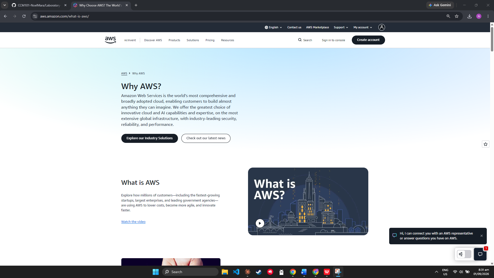

# AWS Research

## Brief Overview
The world's largest public cloud provider — pioneer of modern cloud computing since 2006.

## Global Infrastructure
### Regions
Geographic locations containing multiple data centers (e.g., N. Virginia, Frankfurt, Singapore).
### Availability Zones (AZs)
Physically separate data centers within a Region for fault tolerance.
### Edge Locations
Used by Amazon CloudFront to cache content closer to end users.

## Cloud Management Console
### AWS Management Console
Web-based graphical interface for creating, configuring, and monitoring cloud resources — the primary tool for beginners and administrators. You can use the AWS Management Console to build and deploy cloud resources like servers, databases, and storage buckets. Once your infrastructure is running, you can monitor its performance and check system health metrics directly from your dashboard. It also allows you to control security by managing user access, passwords, and permissions across your account. Finally, you can use it to track your monthly spending, view detailed bills, and run command-line tasks through a built-in terminal.

## Four Core Services
1. **Amazon EC2** – Virtual servers for running applications; scale up or down on demand.
2. **Amazon S3** - Object storage for files, backups, media, and archives in buckets.
3. **Amazon RDS** – Managed relational databases — MySQL, PostgreSQL, SQL Server, and more.
4. **AWS IAM** – Identity & access management using the Principle of Least Privilege.

## Three Advantages
1. **Scalability** – you can scale resources up or down instantly based on demand, instead of buying physical servers
2. **Cost savings (pay-as-you-go)** – no upfront hardware costs; you only pay for what you use
3. **Security** – AWS provides built-in security tools and compliance certifications

## Typical Enterprise Use Cases
1. Hosting websites/web applications `(using EC2, S3)`
2. Data backup and disaster recovery `(using S3, Glacier)`
3. Streaming media `(Netflix famously runs on AWS)`

## Screenshot

