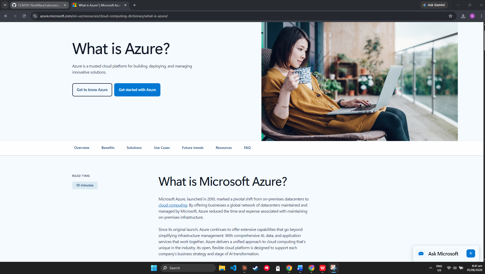

# Azure Research

## Brief Overview
Comprehensive cloud services with deep integration into the Microsoft enterprise ecosystem, launched publicly in 2010.

## Global Infrastructure
### Region
Geographic areas with one or more data centers (e.g., East US, West Europe).
### Availability Zones
Physically separate data centers with independent power & cooling.
### Region Pairs
Each region paired with another for disaster recovery and replication.

## Cloud Management Console
### Azure Portal 
Web-based graphical interface for creating, configuring, and monitoring cloud resources — the primary tool for beginners and administrators. You can use the Azure Portal to build, deploy, and manage cloud infrastructure like virtual machines, databases, and web applications. Once your resources are live, you can monitor their health, view performance metrics, and set up automated alerts for any issues. It also allows you to control security by managing user identities, setting up multi-factor authentication, and defining strict access permissions. Finally, you can use the portal to track your monthly cloud spending, analyze costs, and run command-line scripts through the built-in Azure Cloud Shell.

## Four Core Services
1. **Azure Virtual Machines** – On-demand virtual servers to host apps, databases, and dev environments.
2. **Azure Blob Storage** – Object storage for unstructured data: files, images, video, and backups.
3. **Azure Virtual Network** – Secure virtual networks connecting VMs, services, and on-premises infrastructure.
4. **Microsoft Entra ID** – Identity & access management — formerly Azure Active Directory.

## Three Advantages
1. **Hybrid Cloud Integration** – seamlessly connects on-premises servers with the cloud, so companies can migrate gradually instead of all at once
2. **Microsoft Ecosystem Integration** – works natively with Windows Server, Active Directory, and Microsoft 365, making it easy for existing Microsoft-based businesses to adopt
3. **Enterprise Compliance** – widely trusted by large enterprises and government agencies, with strong compliance certifications for regulated industries

## Typical Enterprise Use Cases
1. Migrating Windows Server and Active Directory to the cloud `(using Azure VMs, Azure AD/Entra ID)`
2. Enterprise productivity and collaboration `(integrating with Microsoft 365, Teams, SharePoint)`
3. Hybrid cloud deployments `(using Azure Arc, Azure Stack)`

## Screenshot

