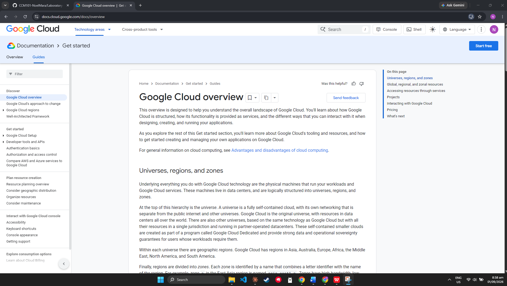

# GCP Research

## Brief Overview
Leverages Google's global infrastructure — the same network behind Search, YouTube, and Gmail, launched in 2008.

## Global Infrastructure
### Regions
Geographic locations with multiple data centers (e.g., Iowa, Belgium, Singapore).
### Zones
Deployment areas within a Region for redundancy and fault isolation.
### Global Network
One of the world's largest private fiber-optic networks.

## Cloud Management Console
### Google Cloud Console
Web-based graphical interface for creating, configuring, and monitoring cloud resources — the primary tool for beginners and administrators. You can use the GCP Console to deploy and scale infrastructure like virtual machines, Kubernetes clusters, and cloud storage buckets. Once your applications are running, you can monitor their performance, analyze system logs, and debug errors using integrated tools like Cloud Logging and Cloud Monitoring. It also allows you to control security by managing user access, creating service accounts, and enforcing encryption keys. Finally, you can use the console to track your real-time cloud spending, set up budget alerts, and run commands directly in your browser using the built-in Google Cloud Shell.

## Four Core Services
1. **Compute Engine** – Google's IaaS offering for creating and managing virtual machines.
2. **Cloud Storage** - Object storage for unstructured data using storage buckets & classes.
3. **Virtual Private Cloud** – Software-defined, isolated virtual networks with firewall rules.
4. **Cloud IAM** – Identity & access management following least-privilege principles.

## Three Advantages
1. **Superior Data Analytics** – built on the same infrastructure Google uses for Search and YouTube, with powerful tools like BigQuery for analyzing massive datasets quickly
2. **AI & Machine Learning Leadership** – Google pioneered Kubernetes and TensorFlow, giving GCP a strong edge in AI/ML workloads and container orchestration
3. **Competitive & Flexible Pricing** – offers sustained-use discounts automatically and per-second billing, often making it more cost-effective for variable workloads

## Typical Enterprise Use Cases
1. Big data analytics and business intelligence `(using BigQuery, Dataflow)`
2. AI and machine learning application development `(using Vertex AI, TensorFlow)`
3. Container orchestration and microservices deployment `(using Google Kubernetes Engine)`

## Screenshot

